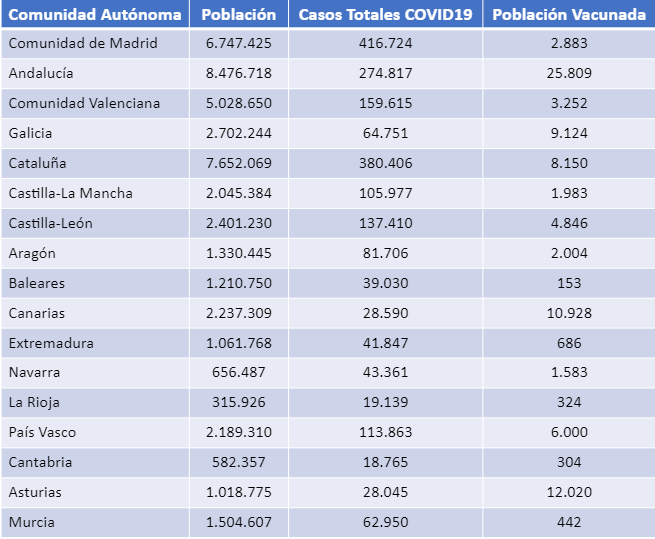
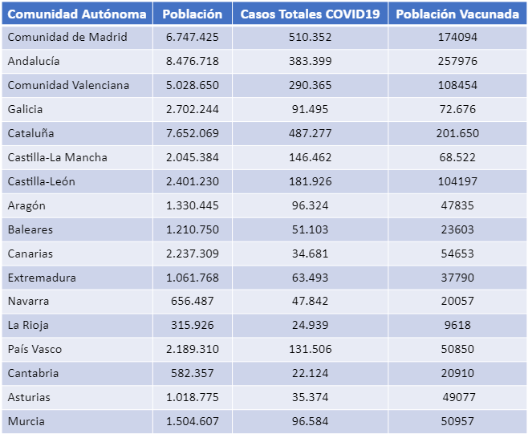
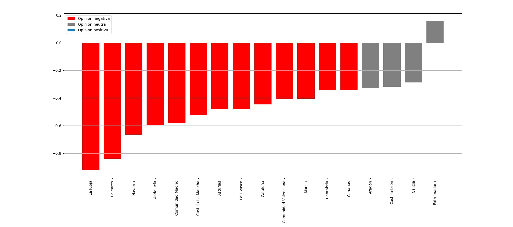
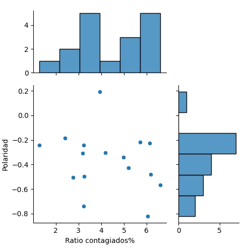
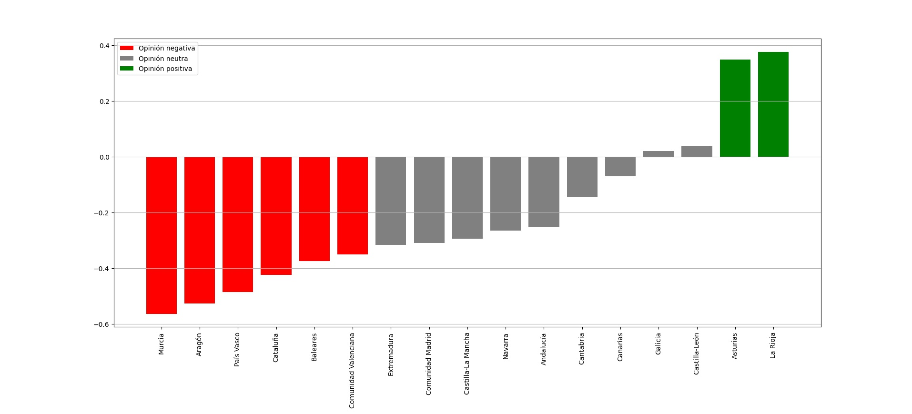
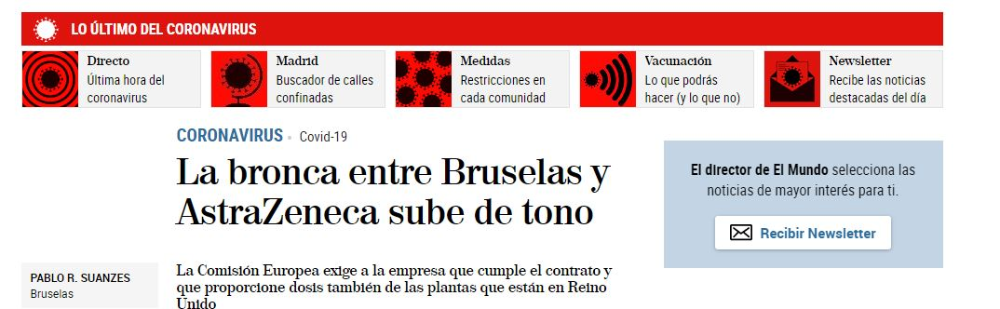

# **Análisis de sentimientos de la vacuna del Covid-19 en España por Comunidades Autónomas**

El Covid-19 ha marcado un antes y un después en la sociedad. Apenas 1 año después de que la pandemia se extendiera, numerosas farmacéuticas han desarrollado una vacuna que se está suministrando de forma global, debido a la necesidad que hay de encontrar una solución para erradicar el Covid-19. Sin embargo, se ha convertido en un tema controvertido dadas las diferentes opiniones que 
surgen como consecuencia de la rápida elaboración de ésta y de la compleja organización que requiere su suministro a nivel global, teniendo en cuenta las peculiares condiciones que requiere su conservación y traslado.

## **Objetivos del proyecto**

El objetivo del proyecto es analizar la opinión que tiene la población española, clasificándolo según la Comunidad Autónoma a la que pertenece, hacia la vacuna del Covid-19 que ha comenzado a suministrase en diciembre del 2020, basándose en las manifestaciones expresadas a través de las redes sociales, en concreto, Twitter para ver su repercusión. 

## **Herramientas empleadas en el desarrollo del proyecto**

Para la implementación del proyecto, se ha utilizado:
 
•	Cuenta de desarrollador de Twitter. Necesario para obtener las claves para el uso del API. 

•	Entorno de desarrollo: Emacs.

•	API de python para la recolección de tweets: tweepy.

•	API de python para obtener la latitud y longitud de cada Comunidad Autónoma: geopy.

•	API de python análisis de sentimientos: SentimentClassifier (spanish_sentiment_analysis de marisa-trie)

## **Desarrollo del proyecto**

El proyecto se ha realizado en python 3 y se ha dividido en diferentes fases:


**FASE 1.- Dataset de las Comunidades Autónomas**

Lo primero que se ha realizado, ha sido una tabla con las diferentes comunidades autónomas junto con el radio que tendrían si se aproximaran a un área circular. Todos estos datos se usarán para la creación de los archivos donde se almacenarán los tweets y para la obtención de las coordenadas de las Comunidades Autónomas a la hora de la captura.


**FASE 2.- Captura y almacenamiento de Tweets**

Después, se ha capturado los tweets que tuvieran las palabras ```vacuna covid``` y/o ```vacuna coronavirus```, que estuvieran en una región concreta (se ha iterado para así obtener el de todas las Comunidades Autónomas) y solo tweets en español. A continuación, se crea un fichero con el nombre de la Comunidad Autónoma dentro de una carpeta llamada "Tweets" donde se almacenarán los tweets capturados previamente desechando aquéllos que únicamente son respuesta a éstos y depurándolos eliminando los emoticonos, banderas, enlaces, menciones (@usuario), señal de retweet (RT @usuario) y otros caracteres especiales.


**FASE 3.- Análisis de sentimientos**

Mediante la API ```spanish_sentiment_analysis``` se ha analizado el sentimiento que expresa cada tweet almacenado en cada fichero de las Comunidades Autónomas. La función ```append``` devuelve un número entre 0 y 1. Siendo en el 0 el valor que representa un sentimiento muy negativo, el 1 representa el sentimiento más positivo y entre medias, en el 0.5, un sentimiento neutro.

Después de evaluar cada tweet, se ha hecho la media de la polaridad que se expresa en el fichero de esa Comunidad Autónoma. Dado que la asignación que hace la función no es muy representativa en los gráficos, se ha hecho un ajuste (restando 0.5 y multiplicándolo por 2) para que así se represente entre -1 y 1. Siendo el -1 el valor que representa el sentimiento más negativo, el 1 el más positivo, y los cercanos a 0, neutros. Y se han ordenado de menor a mayor.


**FASE 4.- Obtención de los datos de casos de Covid-19 y de número de personas vacunadas**

Adicionalmente, para hacer un estudio más detallado y poder realizar unas conclusiones más detalladas, hemos introducido los casos de Covid-19 que había en cada Comunidad Autónoma el día 7 de enero de 2021. También, el número de vacunados. Los datos han sido obtenidos de la [página web de RTVE](https://www.rtve.es/noticias/20210128/mapa-del-coronavirus-espana/2004681.shtml).

Con estos datos, y conociendo la población que tiene cada Comunidad Autónoma se ha obtenido el ratio de personas contagiadas y vacunadas.

**Datos tomados el 2 de Enero de 2021**



**Datos tomados el 26 de Enero de 2021**




**FASE 5.- Representación de los datos calculados y obtenidos**

Finalmente se ha representado el análisis de sentimientos obtenidos, junto con un ratio que relaciona esta polaridad y el número de contagiados.

## **Ejecución del proyecto**

Se ejecuta el archivo ```vacuna.py``` como un programa normal de python, pero **antes** es necesario tener descargado los archivos ``` bbox_spain.txt ``` y ```requiremets.txt```. Después, ejecutar en línea de comandos:

```python
pip install -r requirements.txt
```
Recuerda colocar tus claves y tokens de Twitter en el archivo ```vacuna.py``` antes de proceder con la ejecución.

## **Resultados**

Como podemos observar en el análisis de sentimientos entre el 27 de diciembre del 2020 y el 2 de enero de 2021, las opiniones eran más negativas sobre el proceso de vacunación, destacando sobre todo la desconfianza, la crítica por no haber aumentado la plantilla para la vacunación y la mala organización de ésta:



También se representa una relación entre el ratio de contagiados y la polaridad, representando por puntos las diferentes Comunidades Autónomas, en los márgenes, podemos ver el histograma.





## **Conclusiones**


Primeros datos son del 2 de enero de 2021, capturando los tweets hasta siete días atrás, muy cercano a la fecha de comienzo de vacunación)

Lo comparamos con los datos del 24 de enero de 2021.

Según hemos podido comprobar, los sentimientos con respecto a la vacuna van siendo cada vez más positivos, lo cual puede deberse al repunte de casos después de las fiestas de Navidad.


Sin embargo, en los últimos días hemos podido ver algunas noticias que pueden suponer sentimientos más negativos respecto a la vacuna...



**Vamos a comprobarlo**
